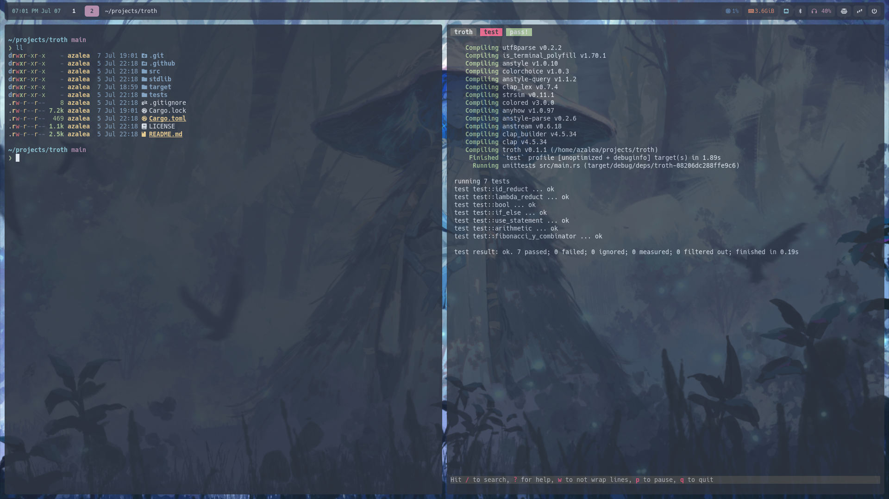

  <h1>Azalea's Nix Flake</h1>

  
  
  
  

  
More Images

  
  

## Layout

[Dotfile layout taken from a friend of mine](https://codeberg.org/da157/nixos). Go check her's out; she has better documentation

- [hosts](https://github.com/azaleacolburn/flake/tree/main/hosts) - machine-level configs
  - [alurya](https://github.com/azaleacolburn/flake/tree/main/hosts/alurya) - desktop workstation
  - [gilarabrywn](https://github.com/azaleacolburn/flake/tree/main/hosts/gilarabrywn) - 2020 M1 macbook air
- [nixos](https://github.com/azaleacolburn/flake/tree/main/nixos) - nixos-specific config
  - [homeConf](https://github.com/azaleacolburn/flake/tree/main/nixos/homeConf) - home-manager config
  - [stylix](https://github.com/azaleacolburn/flake/tree/main/nixos/stylix) - styling config
  - [host](https://github.com/azaleacolburn/flake/tree/main/nixos/host) - nixos system config
- [home](https://github.com/azaleacolburn/flake/tree/main/home) - user-level config
  - [apps](https://github.com/azaleacolburn/flake/tree/main/home/apps) - application config (eg. slack)
  - [desktop](https://github.com/azaleacolburn/flake/tree/main/home/desktop) - desktop environment config (eg. hyprland)
  - [shell](https://github.com/azaleacolburn/flake/tree/main/home/shell) - shell config (eg. zsh)
  - [suites](https://github.com/azaleacolburn/flake/tree/main/home/shell) - groups of programs + config (eg. dev tools)
- [nixvim](https://github.com/azaleacolburn/flake/tree/main/nixvim) - nvim config ([lazy.nvim version](https://github.com/azaleacolburn/.config/tree/main/nvim))
- [media](https://github.com/azaleacolburn/flake/tree/main/media) - wallpapers, etc
